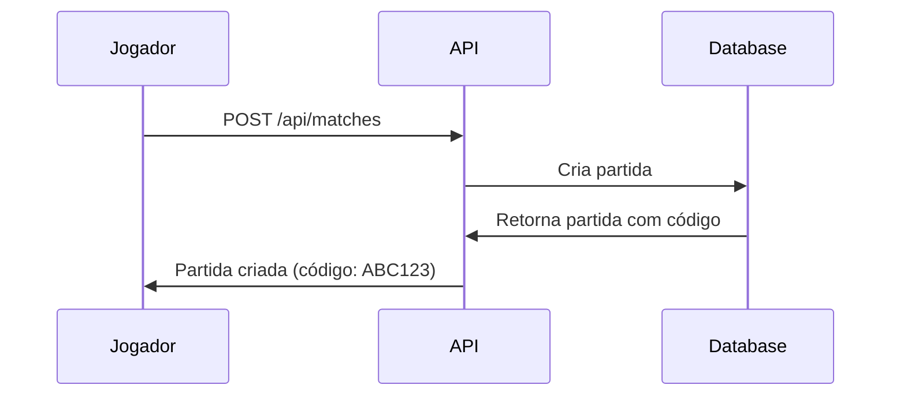
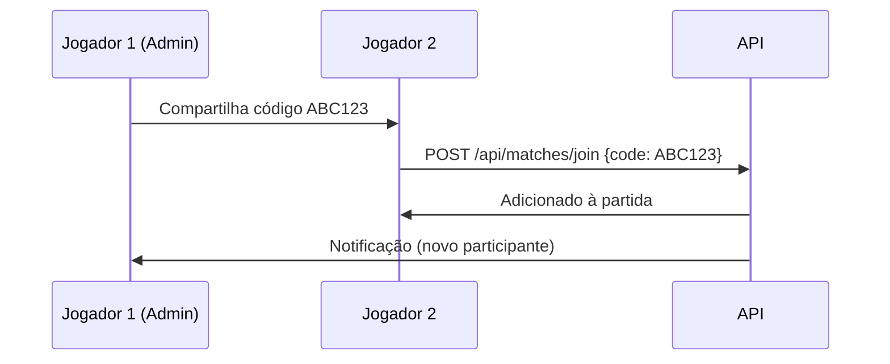

# API de Partidas de Futebol

## Visão Geral

A API de partidas permite que jogadores criem, gerenciem e participem de partidas de futebol. O sistema foi projetado para facilitar a organização de jogos entre amigos e grupos.

---

## Estrutura da Partida

### Campos Principais

| Campo | Tipo | Descrição | Obrigatório |
|-------|------|-----------|-------------|
| `code` | string(6) | Código único para entrada na partida | Sim (gerado automaticamente) |
| `admin_id` | integer | ID do jogador administrador | Sim (automático) |
| `match_date` | date | Data da partida (YYYY-MM-DD) | Sim |
| `match_time` | time | Horário da partida (HH:MM) | Sim |
| `location` | string | Local da partida | Sim |
| `players_count` | enum | Quantidade de jogadores | Sim |
| `end_mode` | enum | Modo de término da partida | Sim |
| `goal_limit` | integer | Limite de gols (se aplicável) | Condicional |
| `time_limit` | integer | Limite de tempo em minutos | Condicional |
| `status` | enum | Status atual da partida | Automático |

### Valores dos Enums

#### `players_count`
- `3vs3` - 6 jogadores total
- `5vs5` - 10 jogadores total  
- `6vs6` - 12 jogadores total

#### `end_mode`
- `goals` - Partida termina quando atingir limite de gols
- `time` - Partida termina quando atingir limite de tempo
- `both` - Partida termina quando atingir qualquer um dos limites

#### `status`
- `waiting` - Aguardando jogadores
- `in_progress` - Partida em andamento
- `finished` - Partida finalizada
- `cancelled` - Partida cancelada

---

## Endpoints da API

### 🔍 **GET** `/api/matches`
Lista todas as partidas disponíveis com paginação.

**Query Parameters:**
- `status` (opcional): Filtrar por status da partida

**Exemplo de Resposta:**
```json
{
  "success": true,
  "data": {
    "current_page": 1,
    "data": [
      {
        "id": 1,
        "code": "ABC123",
        "match_date": "2025-09-15",
        "match_time": "18:00:00",
        "location": "Campo do Botafogo",
        "players_count": "5vs5",
        "end_mode": "both",
        "goal_limit": 5,
        "time_limit": 90,
        "status": "waiting",
        "admin": {
          "id": 1,
          "name": "João Silva",
          "user": {
            "name": "João Silva",
            "email": "joao@example.com"
          }
        },
        "participants": [...]
      }
    ]
  },
  "message": "Lista de partidas recuperada com sucesso"
}
```

---

### ➕ **POST** `/api/matches`
Cria uma nova partida.

**Body (JSON):**
```json
{
  "match_date": "2025-09-15",
  "match_time": "18:00",
  "location": "Campo do Botafogo",
  "players_count": "5vs5",
  "end_mode": "both",
  "goal_limit": 5,
  "time_limit": 90
}
```

**Validações:**
- Data deve ser hoje ou futura
- Horário no formato HH:MM
- Se `end_mode` inclui "goals", `goal_limit` é obrigatório
- Se `end_mode` inclui "time", `time_limit` é obrigatório

---

### 👁️ **GET** `/api/matches/{id}`
Exibe detalhes de uma partida específica.

---

### ✏️ **PUT** `/api/matches/{id}`
Atualiza uma partida existente.

**Restrições:**
- Apenas o administrador da partida pode atualizar
- Campos são opcionais (atualização parcial)

---

### 🗑️ **DELETE** `/api/matches/{id}`
Remove uma partida.

**Restrições:**
- Apenas o administrador da partida pode remover

---

### 🎮 **POST** `/api/matches/join`
Permite que um jogador participe de uma partida usando o código.

**Body (JSON):**
```json
{
  "code": "ABC123"
}
```

**Validações:**
- Partida deve existir
- Partida deve estar com status "waiting"
- Partida não pode estar cheia
- Jogador não pode já estar participando

---

### 🚪 **POST** `/api/matches/{id}/leave`
Permite que um jogador saia de uma partida.

**Restrições:**
- Jogador deve estar participando da partida
- Administrador não pode sair da própria partida

---

## Fluxo de Uso

### 1. Criação de Partida


### 2. Participação em Partida


---

## Regras de Negócio

### ✅ Permissões
- **Qualquer jogador autenticado** pode:
  - Listar partidas
  - Ver detalhes de partidas
  - Criar novas partidas
  - Participar de partidas (via código)
  - Sair de partidas que participa

- **Apenas o administrador** pode:
  - Atualizar a partida
  - Cancelar/deletar a partida
  - Não pode sair da própria partida

### 🔒 Validações de Participação
- Partida deve estar com status "waiting"
- Não pode exceder o limite de jogadores
- Um jogador não pode participar da mesma partida duas vezes
- Código deve ser válido e existir

### 📊 Limites de Jogadores
| Modo | Total de Jogadores |
|------|-------------------|
| 3vs3 | 6 jogadores |
| 5vs5 | 10 jogadores |
| 6vs6 | 12 jogadores |

---

## Códigos de Erro

| Código | Descrição |
|--------|-----------|
| 400 | Dados inválidos ou regra de negócio violada |
| 401 | Não autenticado |
| 403 | Não autorizado (sem permissão) |
| 404 | Partida não encontrada |
| 422 | Erro de validação |

---

## Exemplos de Uso

### Criar uma partida rápida (3vs3, 5 gols)
```bash
curl -X POST /api/matches \
  -H "Authorization: Bearer {token}" \
  -H "Content-Type: application/json" \
  -d '{
    "match_date": "2025-09-15",
    "match_time": "18:00",
    "location": "Quadra do bairro",
    "players_count": "3vs3",
    "end_mode": "goals",
    "goal_limit": 5
  }'
```

### Participar de uma partida
```bash
curl -X POST /api/matches/join \
  -H "Authorization: Bearer {token}" \
  -H "Content-Type: application/json" \
  -d '{
    "code": "ABC123"
  }'
```

### Listar partidas aguardando jogadores
```bash
curl -X GET "/api/matches?status=waiting" \
  -H "Authorization: Bearer {token}"
```
