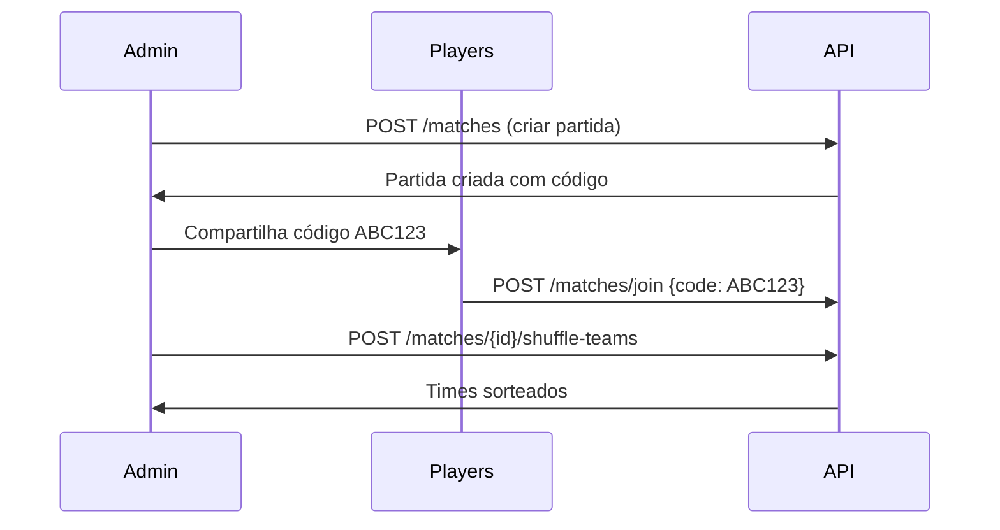
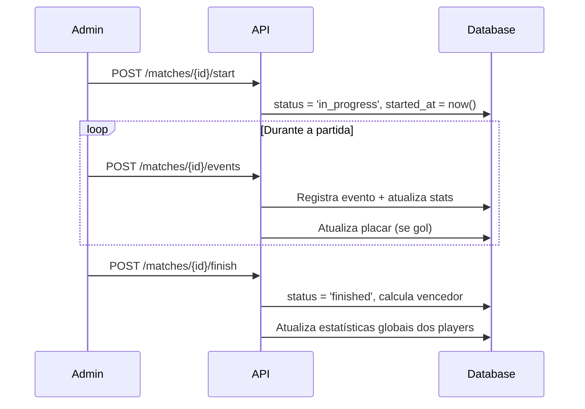

# API de Partidas de Futebol

## Visão Geral

A API de partidas permite que jogadores criem, gerenciem e participem de partidas de futebol. O sistema foi projetado para facilitar a organização de jogos entre amigos e grupos, incluindo funcionalidades avançadas como:

- 🎲 **Sorteio automático de times**
- ⏱️ **Cronômetro e controle de partida**
- 📊 **Registro de eventos em tempo real** (gols, assistências, desarmes, defesas)
- 🏆 **Atualização automática de estatísticas**

---

## Estrutura da Partida

### Campos Principais

| Campo | Tipo | Descrição | Obrigatório |
|-------|------|-----------|-------------|
| `code` | string(6) | Código único para entrada na partida | Sim (gerado automaticamente) |
| `admin_id` | integer | ID do jogador administrador | Sim (automático) |
| `match_date` | date | Data da partida (YYYY-MM-DD) | Sim |
| `match_time` | time | Horário da partida (HH:MM) | Sim |
| `location` | string | Local da partida | Sim |
| `players_count` | enum | Quantidade de jogadores | Sim |
| `end_mode` | enum | Modo de término da partida | Sim |
| `goal_limit` | integer | Limite de gols (se aplicável) | Condicional |
| `time_limit` | integer | Limite de tempo em minutos | Condicional |
| `status` | enum | Status atual da partida | Automático |
| `started_at` | timestamp | Quando a partida iniciou | Automático |
| `finished_at` | timestamp | Quando a partida terminou | Automático |
| `current_minute` | integer | Minuto atual da partida | Automático |
| `is_paused` | boolean | Se a partida está pausada | Automático |
| `winning_team_id` | integer | ID do time vencedor | Automático |

### Valores dos Enums

#### `players_count`
- `3vs3` - 6 jogadores total
- `5vs5` - 10 jogadores total  
- `6vs6` - 12 jogadores total

#### `end_mode`
- `goals` - Partida termina quando atingir limite de gols
- `time` - Partida termina quando atingir limite de tempo
- `both` - Partida termina quando atingir qualquer um dos limites

#### `status`
- `waiting` - Aguardando jogadores
- `in_progress` - Partida em andamento
- `finished` - Partida finalizada
- `cancelled` - Partida cancelada

#### `event_type` (para eventos da partida)
- `goal` - Gol marcado
- `assist` - Assistência
- `tackle` - Desarme
- `defense` - Defesa

---

## Endpoints da API

### 🔍 **GET** `/api/matches`
Lista todas as partidas disponíveis com paginação.

**Query Parameters:**
- `status` (opcional): Filtrar por status da partida

**Exemplo de Resposta:**
```json
{
  "success": true,
  "data": {
    "current_page": 1,
    "data": [
      {
        "id": 1,
        "code": "ABC123",
        "match_date": "2025-09-15",
        "match_time": "18:00:00",
        "location": "Campo do Botafogo",
        "players_count": "5vs5",
        "end_mode": "both",
        "goal_limit": 5,
        "time_limit": 90,
        "status": "waiting",
        "current_minute": 0,
        "is_paused": false,
        "admin": {
          "id": 1,
          "name": "João Silva",
          "user": {
            "name": "João Silva",
            "email": "joao@example.com"
          }
        },
        "teams": [
          {
            "id": 1,
            "team_name": "team_a",
            "team_color": "#FF6B6B",
            "score": 0,
            "players": [...]
          },
          {
            "id": 2,
            "team_name": "team_b",
            "team_color": "#4ECDC4", 
            "score": 0,
            "players": [...]
          }
        ],
        "participants": [...],
        "events": [...]
      }
    ]
  },
  "message": "Lista de partidas recuperada com sucesso"
}
```

---

### ➕ **POST** `/api/matches`
Cria uma nova partida.

**Body (JSON):**
```json
{
  "match_date": "2025-09-15",
  "match_time": "18:00",
  "location": "Campo do Botafogo",
  "players_count": "5vs5",
  "end_mode": "both",
  "goal_limit": 5,
  "time_limit": 90
}
```

---

### 👁️ **GET** `/api/matches/{id}`
Exibe detalhes de uma partida específica.

---

### ✏️ **PUT** `/api/matches/{id}`
Atualiza uma partida existente (apenas administrador).

---

### 🗑️ **DELETE** `/api/matches/{id}`
Remove uma partida (apenas administrador).

---

### 🎮 **POST** `/api/matches/join`
Permite que um jogador participe de uma partida usando o código.

**Body (JSON):**
```json
{
  "code": "ABC123"
}
```

---

### 🚪 **POST** `/api/matches/{id}/leave`
Permite que um jogador saia de uma partida.

---

## 🎲 Gerenciamento de Times

### **POST** `/api/matches/{id}/shuffle-teams`
Sorteia os times automaticamente distribuindo os jogadores de forma aleatória.

**Restrições:**
- Apenas o administrador pode sortear
- Só funciona antes da partida iniciar (`status: waiting`)

**Resposta:**
```json
{
  "success": true,
  "data": {
    "team_a": {
      "id": 1,
      "team_name": "team_a",
      "team_color": "#FF6B6B",
      "score": 0,
      "players": [
        {
          "id": 1,
          "name": "João Silva",
          "user": { "name": "João Silva", "email": "joao@example.com" }
        }
      ]
    },
    "team_b": {
      "id": 2,
      "team_name": "team_b", 
      "team_color": "#4ECDC4",
      "score": 0,
      "players": [...]
    }
  },
  "message": "Times sorteados com sucesso"
}
```

---

## ⏱️ Controle da Partida

### **POST** `/api/matches/{id}/start`
Inicia uma partida que está aguardando jogadores.

**Restrições:**
- Apenas o administrador pode iniciar
- Partida deve estar com `status: waiting`

**Funcionalidades:**
- Cria os times automaticamente se não existirem
- Define `status` para `in_progress`
- Registra `started_at`
- Inicia cronômetro (`current_minute: 0`)

---

### **POST** `/api/matches/{id}/toggle-pause`
Pausa ou resume uma partida em andamento.

**Restrições:**
- Apenas o administrador pode pausar/resumir
- Partida deve estar com `status: in_progress`

---

### **POST** `/api/matches/{id}/finish`
Finaliza uma partida em andamento.

**Restrições:**
- Apenas o administrador pode finalizar
- Partida deve estar com `status: in_progress`

**Funcionalidades:**
- Define `status` para `finished`
- Registra `finished_at`
- Determina o time vencedor
- **Atualiza automaticamente as estatísticas dos jogadores**

---

## 📊 Sistema de Eventos

### **POST** `/api/matches/{id}/events`
Adiciona um evento durante a partida (gol, assistência, desarme, defesa).

**Body (JSON):**
```json
{
  "player_id": 1,
  "event_type": "goal",
  "minute": 25,
  "description": "Gol de pênalti"
}
```

**Tipos de Eventos:**
- `goal` - Adiciona gol ao placar do time e estatística do jogador
- `assist` - Registra assistência para o jogador
- `tackle` - Registra desarme para o jogador  
- `defense` - Registra defesa para o jogador

**Restrições:**
- Apenas o administrador pode adicionar eventos
- Partida deve estar com `status: in_progress`
- Jogador deve estar participando da partida

**Funcionalidades Automáticas:**
- Atualiza placar do time (para gols)
- Atualiza estatísticas em tempo real na tabela `match_participants`
- Registra evento na timeline da partida

---

## 🏆 Sistema de Estatísticas

### Estatísticas Durante a Partida
Cada jogador possui estatísticas específicas para cada partida:

```json
{
  "player": {
    "id": 1,
    "name": "João Silva",
    "pivot": {
      "team_id": 1,
      "goals_scored": 2,
      "assists_made": 1,
      "tackles_made": 3,
      "defenses_made": 0,
      "joined_at": "2025-09-10T18:00:00Z"
    }
  }
}
```

### Atualização das Estatísticas Globais
Ao finalizar a partida, as estatísticas do modelo `Player` são atualizadas automaticamente:

- ✅ **Gols**: `goals` += `goals_scored` da partida
- ✅ **Assistências**: `assists` += `assists_made` da partida  
- ✅ **Desarmes**: `tackles` += `tackles_made` da partida
- ✅ **Partidas**: `matches` += 1
- ✅ **Vitórias**: `wins` += 1 (apenas para o time vencedor)
- ✅ **Rating médio**: Recalculado baseado na performance da partida

### Fórmula do Rating
```
Rating da Partida = 5.0 + (gols × 1.5) + (assistências × 1.0) + (desarmes × 0.5) + (defesas × 0.3)
Rating Médio = ((rating_atual × (total_partidas - 1)) + rating_da_partida) / total_partidas
```

---

## Fluxo Completo de uma Partida

### 1. Criação e Preparação


### 2. Execução da Partida


---

## Regras de Negócio

### ✅ Permissões por Status da Partida

| Ação | waiting | in_progress | finished |
|------|---------|-------------|----------|
| Participar | ✅ | ❌ | ❌ |
| Sair | ✅ | ❌ | ❌ |
| Sortear times | ✅ | ❌ | ❌ |
| Iniciar | ✅ | ❌ | ❌ |
| Pausar/Resumir | ❌ | ✅ | ❌ |
| Adicionar eventos | ❌ | ✅ | ❌ |
| Finalizar | ❌ | ✅ | ❌ |

### 🔒 Controle de Acesso
- **Administrador**: Pode gerenciar todos os aspectos da partida
- **Participantes**: Podem apenas participar/sair (se permitido pelo status)
- **Outros usuários**: Podem visualizar e participar via código

### 📊 Integridade dos Dados
- Times são criados automaticamente quando necessário
- Estatísticas são atualizadas transacionalmente
- Eventos são registrados com timestamp e minuto
- Relacionamentos são mantidos com integridade referencial

---

## Códigos de Erro

| Código | Descrição |
|--------|-----------|
| 400 | Regra de negócio violada (ex: partida em estado inadequado) |
| 401 | Não autenticado |
| 403 | Não autorizado (sem permissão) |
| 404 | Partida/jogador não encontrado |
| 422 | Erro de validação |

---

## Exemplos de Uso

### Fluxo completo de uma partida
```bash
# 1. Criar partida
curl -X POST /api/matches \
  -H "Authorization: Bearer {token}" \
  -d '{
    "match_date": "2025-09-15",
    "match_time": "18:00", 
    "location": "Campo Central",
    "players_count": "5vs5",
    "end_mode": "both",
    "goal_limit": 5,
    "time_limit": 90
  }'

# 2. Outros jogadores participam
curl -X POST /api/matches/join \
  -H "Authorization: Bearer {token}" \
  -d '{"code": "ABC123"}'

# 3. Sortear times
curl -X POST /api/matches/1/shuffle-teams \
  -H "Authorization: Bearer {admin_token}"

# 4. Iniciar partida  
curl -X POST /api/matches/1/start \
  -H "Authorization: Bearer {admin_token}"

# 5. Adicionar eventos
curl -X POST /api/matches/1/events \
  -H "Authorization: Bearer {admin_token}" \
  -d '{
    "player_id": 1,
    "event_type": "goal",
    "minute": 15,
    "description": "Gol de cabeça"
  }'

# 6. Finalizar partida
curl -X POST /api/matches/1/finish \
  -H "Authorization: Bearer {admin_token}"
```
